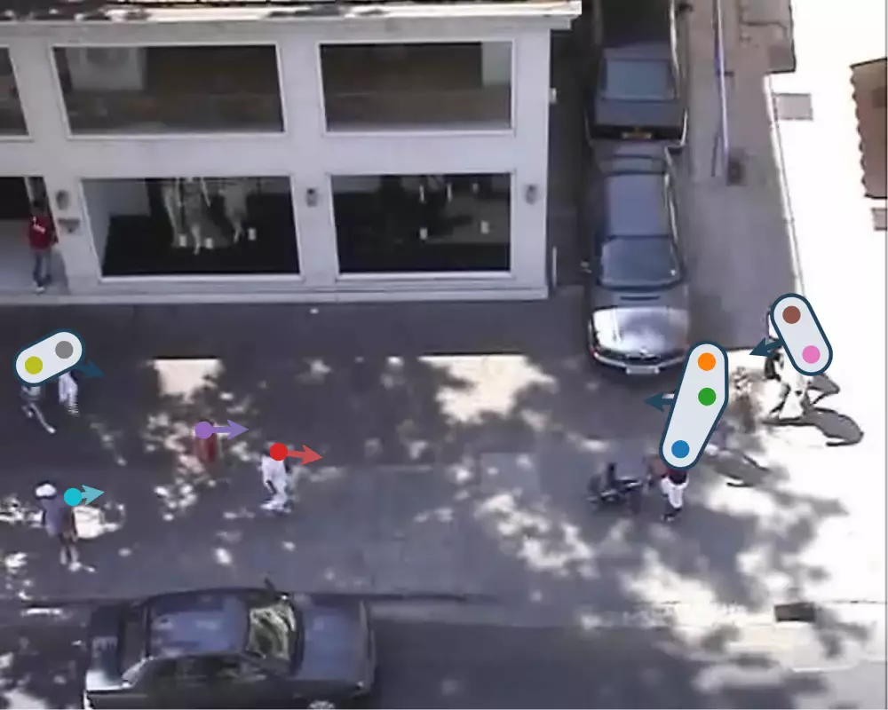

<h2 align="center">Learning Pedestrian Group Representations for<br>Multi-modal Trajectory Prediction</h2>
<p align="center">
  <a href="https://InhwanBae.github.io/"><strong>Inhwan Bae</strong></a>
  ·  
  <a href="https://scholar.google.com/citations?user=0B-YoigAAAAJ"><strong>Jin-Hwi Park</strong></a>
  ·
  <a href="https://scholar.google.com/citations?user=Ei00xroAAAAJ"><strong>Hae-Gon Jeon</strong></a>
  <br>
  ECCV 2022
</p>

<p align="center">
  <a href="https://inhwanbae.github.io/publication/gpgraph/"><strong><code>Project Page</code></strong></a>
  <a href="https://arxiv.org/abs/2207.09953"><strong><code>ECCV Paper</code></strong></a>
  <a href="https://github.com/InhwanBae/GPGraph"><strong><code>Source Code</code></strong></a>
  <a href="#-citation"><strong><code>Related Works</code></strong></a>
</p>

<div align='center'>
  <br>
  
  
</div>

<!--<br>This repository contains the code for unsupervised group estimation applied to the trajectory prediction models.-->
<br>**Summary**: An **unsupervised group estimation** module compatible with **any off-the-shelf trajectory predictor**.

<br>

## 🧑‍🤝‍🧑 GP-Graph Architecture 🧑‍🤝‍🧑
* Learns to assign each pedestrian into the most likely behavior group in an unsupervised manner.
* Pedestrian group pooling&unpooling and group hierarchy graph for group behavior modeling.
* Group-level latent vector sampling strategy to share the latent vector between group members.


## Model Training
### Setup
**Environment**
<br>All models were trained and tested on Ubuntu 20.04 with Python 3.7 and PyTorch 1.9.0 with CUDA 11.1.

**Dataset**
<br>Preprocessed [ETH](https://data.vision.ee.ethz.ch/cvl/aem/ewap_dataset_full.tgz) and [UCY](https://graphics.cs.ucy.ac.cy/research/downloads/crowd-data) datasets are included in this repository, under `./dataset/`. 
The train/validation/test splits are the same as those fond in [Social-GAN](https://github.com/agrimgupta92/sgan).

**Baseline models**
<br>This repository supports the [SGCN](https://arxiv.org/abs/2104.01528) baseline trajectory predictor.
We have included model source codes from [their official GitHub](https://github.com/shuaishiliu/SGCN/tree/0ff25cedc04852803787196e83c0bb941d724fc2) in `model_baseline.py` 

### Train GP-Graph
To train our GPGraph-SGCN on the ETH and UCY datasets at once, we provide a bash script `train.sh` for a simplified execution.
```bash
./train.sh
```
We provide additional arguments for experiments: 
```bash
./train.sh -t <experiment_tag> -d <space_seperated_dataset_string> -i <space_seperated_gpu_id_string>

# Examples
./train.sh -d "hotel" -i "1"
./train.sh -t onescene -d "hotel" -i "1"
./train.sh -t allinonegpu -d "eth hotel univ zara1 zara2" -i "0 0 0 0 0"
```
If you want to train the model with custom hyper-parameters, use `train.py` instead of the script file.


## Model Evaluation
### Pretrained Models
We have included pretrained models in the `./checkpoints/` folder.

### Evaluate GP-Graph
You can use `test.py` to evaluate our GPGraph-SGCN model. 
```bash
python test.py
```


## 📖 Citation
If you find this code useful for your research, please cite our trajectory prediction papers :)

[**`🏢🚶‍♂️ CrowdES (CVPR'25) 🏃‍♀️🏠`**](https://github.com/InhwanBae/Crowd-Behavior-Generation) **|**
[**`💭 VLMTrajectory (TPAMI) 💭`**](https://github.com/InhwanBae/LMTrajectory) **|**
[**`💬 LMTrajectory (CVPR'24) 🗨️`**](https://github.com/InhwanBae/LMTrajectory) **|**
[**`1️⃣ SingularTrajectory (CVPR'24) 1️⃣`**](https://github.com/InhwanBae/SingularTrajectory) **|**
[**`🌌 EigenTrajectory (ICCV'23) 🌌`**](https://github.com/InhwanBae/EigenTrajectory) **|** 
[**`🚩 Graph‑TERN (AAAI'23) 🚩`**](https://github.com/InhwanBae/GraphTERN) **|**
[**`🧑‍🤝‍🧑 GP‑Graph (ECCV'22) 🧑‍🤝‍🧑`**](https://github.com/InhwanBae/GPGraph) **|**
[**`🎲 NPSN (CVPR'22) 🎲`**](https://github.com/InhwanBae/NPSN) **|**
[**`🧶 DMRGCN (AAAI'21) 🧶`**](https://github.com/InhwanBae/DMRGCN)

```bibtex
@inproceedings{bae2022gpgraph,
  title={Learning Pedestrian Group Representations for Multi-modal Trajectory Prediction},
  author={Bae, Inhwan and Park, Jin-Hwi and Jeon, Hae-Gon},
  booktitle={Proceedings of the European Conference on Computer Vision},
  year={2022}
}
```
<details open>
  <summary>More Information (Click to expand)</summary>

```bibtex
@inproceedings{bae2025crowdes,
  title={Continuous Locomotive Crowd Behavior Generation},
  author={Bae, Inhwan and Lee, Junoh and Jeon, Hae-Gon},
  booktitle={Proceedings of the IEEE/CVF Conference on Computer Vision and Pattern Recognition},
  year={2025}
}

@article{bae2025vlmtrajectory,
  title={Social Reasoning-Aware Trajectory Prediction via Multimodal Language Model},
  author={Bae, Inhwan and Lee, Junoh and Jeon, Hae-Gon},
  journal={IEEE Transactions on Pattern Analysis and Machine Intelligence},
  year={2025}
}

@inproceedings{bae2024lmtrajectory,
  title={Can Language Beat Numerical Regression? Language-Based Multimodal Trajectory Prediction},
  author={Bae, Inhwan and Lee, Junoh and Jeon, Hae-Gon},
  booktitle={Proceedings of the IEEE/CVF Conference on Computer Vision and Pattern Recognition},
  year={2024}
}

@inproceedings{bae2024singulartrajectory,
  title={SingularTrajectory: Universal Trajectory Predictor Using Diffusion Model},
  author={Bae, Inhwan and Park, Young-Jae and Jeon, Hae-Gon},
  booktitle={Proceedings of the IEEE/CVF Conference on Computer Vision and Pattern Recognition},
  year={2024}
}

@inproceedings{bae2023eigentrajectory,
  title={EigenTrajectory: Low-Rank Descriptors for Multi-Modal Trajectory Forecasting},
  author={Bae, Inhwan and Oh, Jean and Jeon, Hae-Gon},
  booktitle={Proceedings of the IEEE/CVF International Conference on Computer Vision},
  year={2023}
}

@article{bae2023graphtern,
  title={A Set of Control Points Conditioned Pedestrian Trajectory Prediction},
  author={Bae, Inhwan and Jeon, Hae-Gon},
  journal={Proceedings of the AAAI Conference on Artificial Intelligence},
  year={2023}
}

@inproceedings{bae2022npsn,
  title={Non-Probability Sampling Network for Stochastic Human Trajectory Prediction},
  author={Bae, Inhwan and Park, Jin-Hwi and Jeon, Hae-Gon},
  booktitle={Proceedings of the IEEE/CVF Conference on Computer Vision and Pattern Recognition},
  year={2022}
}

@article{bae2021dmrgcn,
  title={Disentangled Multi-Relational Graph Convolutional Network for Pedestrian Trajectory Prediction},
  author={Bae, Inhwan and Jeon, Hae-Gon},
  journal={Proceedings of the AAAI Conference on Artificial Intelligence},
  year={2021}
}
```
</details>

### Acknowledgement
Part of our code is borrowed from [SGCN](https://github.com/shuaishiliu/SGCN/tree/0ff25cedc04852803787196e83c0bb941d724fc2). 
We thank the authors for releasing their code and models.
